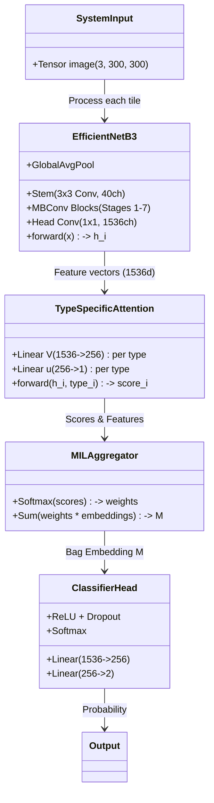

# Knowledge Transfer (KT) Document: Segmentation-guided Type-specific Attention MIL

**Project:** Bacterial vs Fungal Image Classification  
**Status:** Knowledge Transfer / Documentation  
**File:** `Mode2_complete.md`

---

## 1. Problem Statement and System Objective

The primary objective is to classify clinical slit-lamp images into two etiological categories: **Bacterial infection** vs **Fungal infection**. 

*   **Labels:** Image-level (Binary).
*   **Key Challenge:** Discriminative evidence is localized (lesion core, rim, hypopyon) and heterogeneous, while labels are global.
*   **Solution:** A two-stage pipeline ensuring localization, robustness, and interpretability using segmentation-guided Multiple Instance Learning (MIL).

## 2. System Overview

The system consists of two main stages:
1.  **Stage-1:** Multi-class Semantic Segmentation (Attention U-Net) to extract clinically meaningful anatomy.
2.  **Stage-2:** Segmentation-guided Tiling and Type-specific Attention MIL Classifier to aggregate evidence and predict infection type.

### 2.1 Inputs and Outputs
*   **Input:** RGB Image (JPG/PNG/TIFF), resized to 1024×1024.
*   **Primary Output:** Probability of fungal infection $P(\text{fungal})$ and predicted label `{bacterial, fungal}`.
*   **Secondary Outputs:** 
    *   Segmentation masks & overlays.
    *   Tile plan (coordinates, size, type).
    *   Tile attention weights (evidence ranking).
    *   Segmentation biomarkers (e.g., area fractions, rim measures).
    *   Grad-CAM maps for top-attended tiles.
    *   Intermediate embedding probes.

### 2.2 Architectural Rationale
*   **Segmentation:** Constrains attention to disease-bearing anatomy; generates quantitative biomarkers.
*   **MIL:** Handles the "weakly supervised" nature where we have image-level labels but localized evidence.
*   **Type-specific Attention:** Disentangles contributions from distinct regions (lesion vs. rim vs. hypopyon vs. global).

---

## 3. Stage-1 Model: Multi-class Segmentation (Attention U-Net)

### 3.1 Segmentation Target
*   **Head:** 7-class semantic segmentation.
*   **Classes:** Background, Eye Region, Limbus, Hypopyon, Cellular Pattern, Infiltrate/Ulcer, Specular Highlights.

### 3.2 Model Architecture
*   **Architecture:** Attention U-Net (2D) [MONAI implementation].
*   **Mechanism:** Encoder-Decoder with skip connections. Attention gates filter encoder features conditioned on decoder context to suppress irrelevant background.
*   **Hyperparameters:**
    *   `in_channels`: 3 (RGB)
    *   `out_channels`: 7 (Classes)
    *   `channels`: (16, 32, 64, 128, 256)
    *   `strides`: (2, 2, 2, 2)

### 3.3 Outputs
*   **Logits:** $Z \in \mathbb{R}^{C \times H \times W}$ ($C=7$).
*   **Probabilities:** $P(c, x, y) = \text{softmax}(Z)_{c,x,y}$.
*   **Hard Mask:** $\hat{S}(x, y) = \operatorname{argmax}_c P(c, x, y)$.

### 3.4 Training Objective
*   **Loss:** Combined Cross-Entropy + Soft Dice.
    *   $L_{seg} = \lambda \cdot L_{CE} + (1-\lambda) \cdot L_{Dice}$
*   **Goal:** Handle class imbalance (e.g., small hypopyon) and ensure shape overlap.

---

## 4. Segmentation Cache

Segmentation is computationally expensive, so outputs are cached.
*   **Storage:** Compressed NPZ keyed by stable image ID.
*   **Artifacts:**
    *   `preds`: Integer mask ($H \times W$).
    *   `probs`: (Optional) Float tensor ($C \times H \times W$).

---

## 5. Segmentation-guided Tiling Policy

MIL relies on converting an image into a "bag" of instances (tiles). We use the segmentation mask $\hat{S}$ to guide this process.

### 5.1 ROI Masks
We derive binary masks from $\hat{S}$:
*   $M_{hypo} = [\hat{S} == \text{hypopyon\_id}]$
*   $M_{cell} = [\hat{S} == \text{cell\_id}]$
*   $M_{infl} = [\hat{S} == \text{infiltrate\_id}]$
*   **Union ROI (Lesion):** $M_{union} = M_{hypo} \cup M_{cell} \cup M_{infl}$

### 5.2 Rim Band Construction
To capture the transition zone/border (often diagnostic):
*   $M_{rim} = \text{dilate}(M_{union}, r) \setminus M_{union}$
*   Typical $r = 6$ pixels at 1024×1024.

### 5.3 Specular Highlights
*   Detected via HSV (high Value) + optionally dilated.
*   **Action:** Suppress ROI sampling at these locations to avoid false textures.

### 5.4 Bag Composition
A bag consists of **12-14 tiles** with specific types:
1.  **Lesion (Type 0):** Sampled from $M_{union}$. (Target: ~35%)
2.  **Edge/Rim (Type 1):** Sampled from $M_{rim}$. (Target: ~50%)
3.  **Hypopyon (Type 2):** Sampled from $M_{hypo}$. (Target: ~15%)
4.  **Global (Type 3):** Sampled from full image context. (Min 1 tile)

*   **Tile Processing:**
    *   Base size on canvas: 256×256 (adaptive: 384 for large rim, 192 for small regions).
    *   Resized to **300×300** for EfficientNet.
    *   Normalized (ImageNet stats).

---

## 6. Stage-2 Model: Type-specific Attention MIL Classifier

### 6.1 Tile Encoder Backbone (EfficientNet-B3)
*   **Input:** Single tile $x_i$ (300×300 RGB).
*   **Model:** EfficientNet-B3 (Torchvision).
*   **Features:** MBConv blocks (Depthwise Separable Conv + Squeeze-and-Excitation).
*   **Output:** Embedding $h_i \in \mathbb{R}^{1536}$ (after Global Average Pooling).

**Checkpoint-Validated Architecture Details:**
*   **Stem:** 3x3 Conv $\to$ 40 channels.
*   **Stages 1-7:** Stacked MBConv blocks with increasing channels (24, 32, 48, 96, 136, 232, 384).
*   **Head Conv:** 1x1 Conv mapping 384 $\to$ 1536 channels.
*   **Params:** ~10.7M parameters.

### 6.2 Type-specific Attention Pooling (ABMIL)
This module aggregates tile embeddings $h_i$ into a bag representation $M$, respecting tile types.

*   **Input:** Set of pairs $\{(h_i, t_i)\}$ where $t_i \in \{\text{lesion, edge, hypopyon, global}\}$.
*   **Mechanism:** Separate attention scorers for each tile type.
    *   Scorer $V_t: \mathbb{R}^{1536} \to \mathbb{R}^{256}$ (Linear)
    *   Scorer $u_t: \mathbb{R}^{256} \to \mathbb{R}^{1}$ (Linear)
    *   **Score:** $s_i = u_{t_i}^T \cdot \tanh(V_{t_i} h_i)$
    *   **Weights:** $a_i = \frac{\exp(s_i)}{\sum_j \exp(s_j)}$ (Softmax over bag)
    *   **Aggregation:** $M = \sum_i a_i h_i$
*   **Params:** ~1.9M parameters.

### 6.3 Classification Head
*   **Input:** Bag embedding $M \in \mathbb{R}^{1536}$.
*   **Structure:** MLP (Linear $1536 \to 256$ + ReLU + Dropout + Linear $256 \to 2$).
*   **Output:** Logits $\in \mathbb{R}^2$.
*   **Prediction:** $P(\text{fungal}) = \text{softmax}(\text{logits})_1$.

---

## 7. Data Flow & System Diagrams

### 7.1 Detailed Data Flow

```mermaid
graph TD
    subgraph Inputs
    Img[Original Image] --> Resize[Resize to 1024x1024]
    end

    subgraph "Stage 1: Segmentation"
    Resize --> AttUNet[Attention U-Net]
    AttUNet --> Logits[Logits 7x1024x1024]
    Logits --> Softmax[Softmax]
    Softmax --> Argmax[Argmax]
    Argmax --> Mask[Hard Mask (S_hat)]
    Mask -.-> Cache[(Segmentation Cache)]
    end

    subgraph "Tiling Policy & Pre-processing"
    Mask --> ROI_Gen{ROI Generation}
    ROI_Gen --> M_hypo[Hypopyon Mask]
    ROI_Gen --> M_union[Lesion Mask]
    ROI_Gen --> M_rim[Rim/Edge Mask]
    
    Resize --> TileSampler[Tile Sampler]
    M_hypo --> TileSampler
    M_union --> TileSampler
    M_rim --> TileSampler
    
    TileSampler --> BagOfTiles[Bag of 12-14 Tiles]
    subgraph Tile_Structure
    T1[Tile 1: Lesion]
    T2[Tile 2: Lesion]
    T3[Tile 3: Edge]
    T4[Tile 4: Hypopyon]
    T5[Tile N: Global]
    end
    BagOfTiles --- T1 & T2 & T3 & T4 & T5
    end

    subgraph "Stage 2: MIL Classifier"
    BagOfTiles --> Norm[ImageNet Norm]
    Norm --> EffNet[Backbone: EfficientNet-B3]
    EffNet --> Embeds[Tile Embeddings h_i (1536d)]
    
    Embeds --> AttnMech{Type-Specific Attention}
    subgraph ABMIL_Head
    AttnMech --> ScorerL[Scorer: Lesion]
    AttnMech --> ScorerE[Scorer: Edge]
    AttnMech --> ScorerH[Scorer: Hypopyon]
    AttnMech --> ScorerG[Scorer: Global]
    
    ScorerL & ScorerE & ScorerH & ScorerG --> AttnScores[Attention Scores s_i]
    AttnScores --> AttnWeights[Attention Weights a_i]
    
    Embeds & AttnWeights --> WeightedSum[Weighted Sum (Aggregation)]
    WeightedSum --> BagEmbed[Bag Embedding M]
    end
    
    BagEmbed --> Classifier[MLP Head]
    Classifier --> FinalProb[P(fungal)]
    end

    subgraph Outputs
    FinalProb --> Label[Predicted Label]
    AttnWeights --> Exp[Explanations]
    Exp --> Heatmaps[Regional Importance]
    Exp --> GradCAM[Grad-CAM on Top Tiles]
    Mask --> BioMarkers[Biomarkers: Area/Shape]
    end
```

### 7.2 Model Architecture Detail (EfficientNet + MIL)



---

## 8. Training Protocol

### 8.1 Segmentation Training
*   **Data:** Paired Image-Mask samples.
*   **Splits:** Patient-level isolation.
*   **Augmentation:** Geometric (flips, rotations) + Photometric (brightness/contrast) - clinically plausible.
*   **Metrics:** Per-class Dice, Per-class IoU, Mean Dice.

### 8.2 MIL Training
*   **Data:** Bags of tiles + Image-level Labels.
*   **Objective:** Cross-Entropy on image-level logits.
*   **Optimizer:** AdamW with weight decay.
*   **Strategy:** Optional backbone freezing for initial epochs to stabilize attention weights.
*   **Thresholding:** $\tau$ selected on validation set (maximizing Youden's J or Balanced Accuracy).

---

## 9. Inference & Interaction

1.  **Load Image:** Read and resize.
2.  **Segmentation:** Run Stage-1 or load from cache.
3.  **Plan Tiles:** Generate tile coordinates based on masks ($M_{union}, M_{rim}, M_{hypo}$).
4.  **Extract:** Crop tiles, resize to 300x300, normalize.
5.  **Inference:**
    *   Encode tiles (EfficientNet).
    *   Compute Attention Scores (Type-specific).
    *   Aggregate & Classify.
6.  **Return Package:** Label, Probability, overlays, attention map, biomarkers.

---

## 10. Explainability & Biomarkers

### 10.1 Attention Summaries
Attention weights $a_i$ indicate which tiles drove the decision. We aggregate these by type to see which anatomical feature was most important:
*   $Mass_{edge} = \sum a_i \cdot \mathbb{I}(t_i = edge)$
*   $Mass_{lesion} = \sum a_i \cdot \mathbb{I}(t_i = lesion)$
*   $Mass_{hypo} = \sum a_i \cdot \mathbb{I}(t_i = hypopyon)$

### 10.2 Grad-CAM
Applied to the **top-k most attended tiles**. Localizes the specific pixels within the tile (e.g., a specific texture in the rim) that activated the fungal class logit.

### 10.3 Segmentation Biomarkers
Quantitative measures automatically extracted from Stage-1 masks:
*   **Union Area Fraction:** $|M_{union}| / (H \cdot W)$
*   **Hypopyon Area Fraction:** $|M_{hypo}| / (H \cdot W)$
*   **Rim Area Fraction:** $|M_{rim}| / (H \cdot W)$

### 10.4 Intermediate Probes
Global Average Pooling of intermediate EfficientNet feature maps ($E_l$) allows training simple linear probes (logistic/linear regression) to predict clinical outcomes like severity grade or healing time, distinct from the primary diagnostic label.
